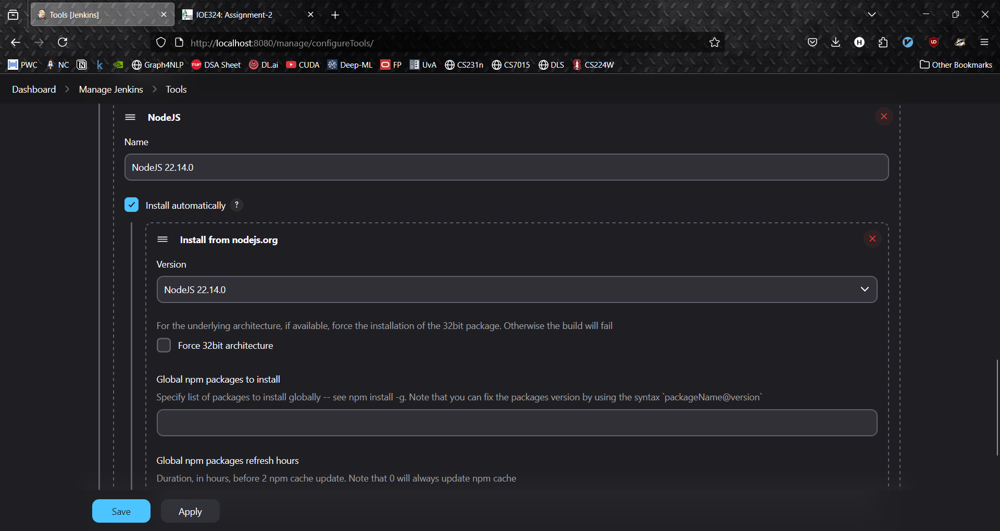
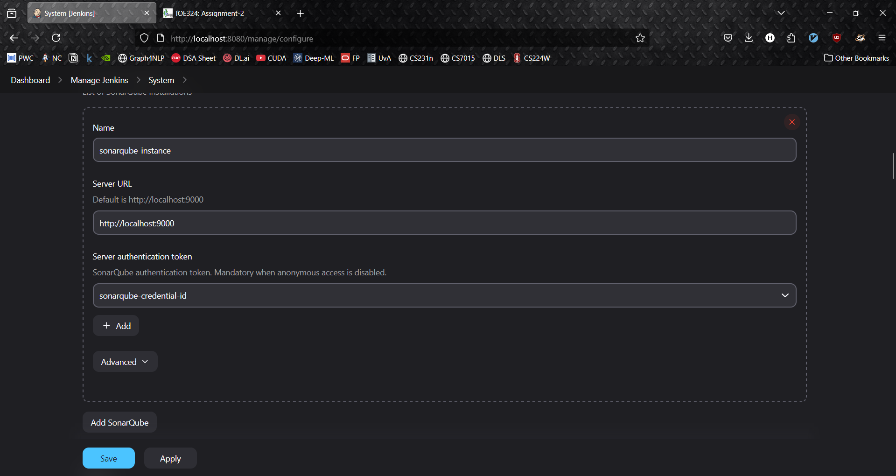
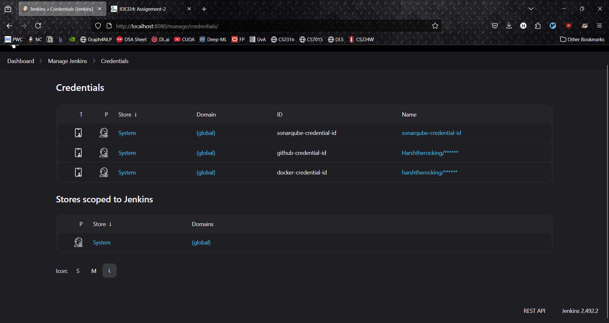
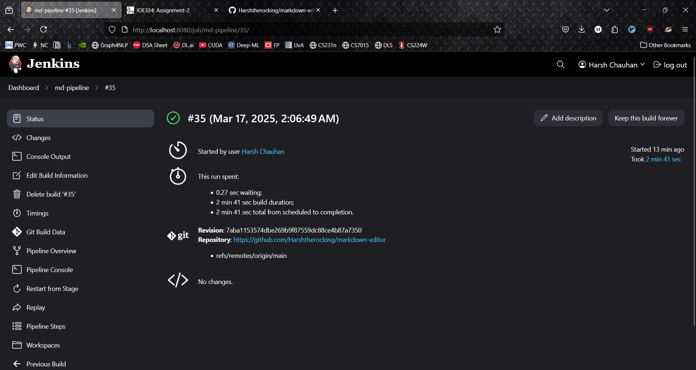

### Harsh Vardhan Singh Chauhan 
### 2022BCD0044
### DevOps Assignment

#### 1. Git repo pulling 
`git clone https://github.com/Harshtherocking markdown-editor.git`

#### 2. Build using NPM
nodejs instance

```console
 stage('Setup Node.js') {
            steps {
                echo "Setting up Node.js ${NODE_VERSION}"
                nodejs(nodeJSInstallationName: "NodeJS ${NODE_VERSION}") {
                    bat 'node --version'
                    bat 'npm --version'
                }
            }
        }
        
        stage('Install Dependencies') {
            steps {
                echo "Installing project dependencies"
                nodejs(nodeJSInstallationName: "NodeJS ${NODE_VERSION}") {
                    bat 'npm ci'
                }
            }
        }
```


#### 3. Integrate with SonarQube
solarqube instance

```console
stage('SonarQube Analysis') {
            steps {
                echo "Running SonarQube analysis"
                withSonarQubeEnv('SonarQube') {
                    nodejs(nodeJSInstallationName: "NodeJS ${NODE_VERSION}") {
                        bat '''
                        npm install -g sonarqube-scanner
                        sonar-scanner ^
                          -Dsonar.projectKey=${SONAR_PROJECT_KEY} ^
                          -Dsonar.sources=. ^
                          -Dsonar.host.url=${SONAR_HOST_URL} ^
                          -Dsonar.token=${SONAR_LOGIN} ^
                          -Dsonar.javascript.lcov.reportPaths=coverage/lcov.info ^
                          -Dsonar.exclusions=node_modules/**,test/**,coverage/**
                        '''
                    }
                }
            }
        }
```
`sonarqube.properties`
```
sonar.projectKey=md-editor-online
sonar.projectName=md-editor-online
sonar.projectVersion=1.0
sonar.sources=src
sonar.sourceEncoding=UTF-8
sonar.exclusions=node_modules/**/*,dist/**/*
```

#### 4. Dockerize the app 
```dockerfile
# Build stage
FROM node:18-alpine AS build

WORKDIR /app

# Copy package.json and package-lock.json
COPY package*.json ./

# Install dependencies
RUN npm ci

# Copy the rest of the application
COPY . .

# Build the app
RUN npm run build

# Production stage with nginx for the frontend
FROM nginx:alpine as frontend

# Copy built assets from the build stage
COPY --from=build /app/dist /usr/share/nginx/html
COPY nginx.conf /etc/nginx/conf.d/default.conf

# Server stage for backend
FROM node:18-alpine as backend

WORKDIR /app

# Copy package.json and package-lock.json
COPY package*.json ./
COPY server/ ./server/

# Install only production dependencies
RUN npm ci --only=production

EXPOSE 3001

CMD ["node", "server/index.js"]

# Final stage: Combined container with both frontend and backend
FROM nginx:alpine

# Copy frontend files
COPY --from=frontend /usr/share/nginx/html /usr/share/nginx/html
COPY --from=frontend /etc/nginx/conf.d/default.conf /etc/nginx/conf.d/default.conf

# Install Node.js
RUN apk add --update nodejs npm

# Create app directory for backend
WORKDIR /app

# Copy backend files
COPY --from=backend /app /app

# Expose ports
EXPOSE 80 3001

# Start both services
COPY start.sh /start.sh
RUN chmod +x /start.sh

CMD ["/start.sh"]
```

#### 5. Containerization and Deployment
```console
stage('Build Docker Image') {
            steps {
                echo "Building Docker image"
                bat "docker build -t ${DOCKER_IMAGE_NAME}:${BUILD_NUMBER} ."
                bat "docker tag ${DOCKER_IMAGE_NAME}:${BUILD_NUMBER} ${DOCKER_IMAGE_NAME}:latest"
            }
        }
        
        stage('Push Docker Image') {
            steps {
                script {
                    withCredentials([usernamePassword(credentialsId: 'docker-credential-id', usernameVariable: 'DOCKER_USERNAME', passwordVariable: 'DOCKER_PASSWORD')]) {
                        echo "Logging into Docker Hub..."
                        bat "echo %DOCKER_PASSWORD% | docker login -u %DOCKER_USERNAME% --password-stdin"

                        echo "Pushing Docker image..."
                        bat "docker push %DOCKER_IMAGE_NAME%:latest"
                        bat "docker push %DOCKER_IMAGE_NAME%:latest"

                        bat "docker logout"
                    }
                }
            }
        }

        stage('Deploy') {
            steps {
                script {
                    echo "Deploying Docker container..."

                    // Extract the container name (md-editor)
                    // def containerName = DOCKER_IMAGE_NAME.split('/')[1]
                    def containerName = "md-editor"
                    
                    // Stop and remove the container if it exists
                    bat "docker stop %containerName% || exit 0"
                    bat "docker rm %containerName% || exit 0"

                    // Run the new container
                    // bat "docker run -d --name %containerName% -p 8080:8080 %DOCKER_IMAGE_NAME%:latest"
                }
            }
        }
    }
```

__credentials check__


__pipeline status__

__pipeline graph__

__docker hub image added__


__application deployed__ 


__THE END__